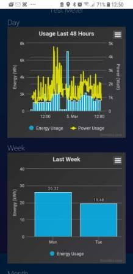
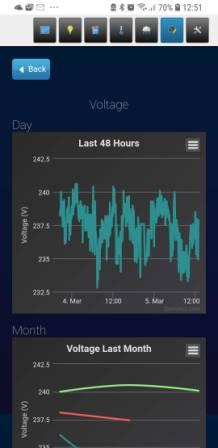
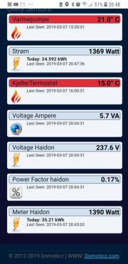

# Han-power meter
AMS powermeter interface 

  Norwegian AMS power meter sensor/adapter for MySensors and controllers like Domoticz
  
  This is a sensornode for Mysensor, it has a parser that read OBIS codes and meter data from the HAN port of a Norwegian Aidon power meter.
  The parser read the Norwegian HAM code specification - OBIS codes.
  This adapter parses the format according to the format specification and mostly independent of order and content of each message and record.
  Ref https://www.nek.no/wp-content/uploads/2018/11/Aidon-HAN-Interface-Description-v10A-ID-34331.pdf
  and EXCERPT DLMS UA Blue Book: COSEM interface classes and OBIS identification system, EXCERPT DLMS UA 1000-1 Ed. 12.0
  
  Hardware is an arduino that reads a serial data stream form a Mbus to ttl adapter.  
  The MBus converter is connected to the HAN port of the power meter.
  The Adapter is tested with Hafslund Aidon meter, a arduino my sensor node and a Mbus adapter:
  https://www.ebay.com/itm/TSS721A-Breakout-Module-with-Isolation/113359924361?hash=item1a64c72c89:g:gS0AAOSwF31b5paL:rk:4:pf:0

  The arduino MySensor node is connected to a rasperry Domoticz controller via a 2.4 Mhz mesh network. Ref mySensor.org
  
  Keywords: AMS powermeter, HAN port, OBIS, Mbus, COSEM, Domotizc, mysensors
  
  Jon Ola Hove

  Notes:
  Software serial can be used to test the parser,
  but on a 3.3V on 8Mhz this might be to slow when parsing the one hour message, use rx tx. 
  
  The 8mhz arduino is of this type:
  https://forum.mysensors.org/topic/2067/my-slim-2aa-battery-node
  
  This Arduno can probably be powered from the Mbus interface. This is not tested.
  Currently the card is powered with 3.3V via a step-down regulator from 5 v, it consumed 35ma, including loss in the regulator.

  The mysensors data is sent in senddata().

  This parser is a top down recursive parser driven by the grammar of the message,
  specified in the reference above.  The basic grammar is:

  Hdlspackage = startmark, packagelen, frameheader, payload, FCC, endmark
  startmark = endmark = “7E”
  packagelen = 4 byte ; “A”, 12 bit integer
  frameheader = 9 byte ; Not checked, ends with a crc
  payload = dataheader, array, register*
  dataheader = “0f 40 00 00 00 00”  ; might not be fixed
  array = «01», dataLen
  dataLen = 1 byte; Int
  register = structure, structureContent;
  structureContent = octetString, OBIScodeandContent  ; se code for details

  Example:

  Header   a0 2a 41 08 83 13 04 13 e6 e7 00 : FrameType: 10 FrameLength: 42
  DataHeader 0f 40 00 00 00 00
  Type & Len 01 01

  02 03  : Structur – 3
  09 06  : ocet-string len 6
  01 00 01 07 00 ff : OBIS kode  '1.0.1.7.0.255
  06  : double-long-unsigned   (32bit)
  00 00 06 44  : dec 1604
  02 02 : Structur – 2
  0f  Int8
  00 : 0
  16  : enum
  1b : Watt active power
  6f 92  CRC

  ----
  TODO: CRC is not checked,
  test power form the Mbus
  restructure the parser to a c++ class
  There is some isue witk tha last parts of the one hour massage, but it does not effect the data.

##Hardware

##Power meter in Domoticz 

